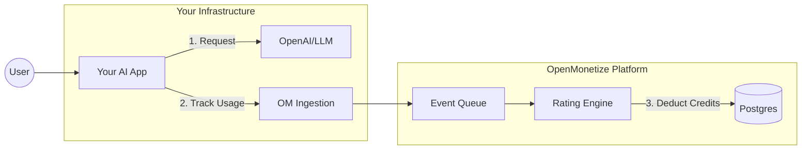

# OpenMonetize

**The "Smart Meter" for AI Consumption.**

Open Source Pricing & Billing Infrastructure to track tokens, manage credits, and bill for actual usage.

[](https://railway.app/new/template?template=https%3A%2F%2Fgithub.com%2Fopenmonetize%2Fopenmonetize&referralCode=YOUR_REFERRAL_CODE&utm_source=github_readme&utm_medium=button&utm_campaign=launch_v1)

[](LICENSE)
[](https://www.typescriptlang.org/)
[](https://nodejs.org/)
[](https://www.postgresql.org/)
[](https://redis.io/)

---

## ⚡ The 30-Second Demo

Don't just read about it. Here is how you integrate OpenMonetize into your AI app in 3 steps.

### 1. The Setup

You wrap your LLM calls (OpenAI, Anthropic, etc.) with our lightweight SDK.

```typescript
import { OpenMonetize } from '@openmonetize/sdk';

const om = new OpenMonetize({ apiKey: process.env.OM_API_KEY });
```

### 2. The Usage (Input)

When a user makes a request, you track the consumption. We handle the math, the concurrency, and the debits.

```typescript
// Inside your API route
const response = await openai.chat.completions.create({
  model: "gpt-4",
  messages: [{ role: "user", content: "Hello world" }],
});

// 🔥 This is the magic line
await om.track({
  userId: "user_123",
  feature: "gpt-4-completion", // Maps to your burn table (e.g., $0.03/1k tokens)
  usage: {
    inputTokens: response.usage.prompt_tokens,
    outputTokens: response.usage.completion_tokens
  }
});
```

### 3. The Result (Output)

The user's wallet is instantly updated. You can query this to gate features or show balances.

```json
// await om.wallets.get("user_123");

{
  "userId": "user_123",
  "balance": 450.25,
  "currency": "CREDITS",
  "status": "ACTIVE",
  "lastTransaction": {
    "amount": -1.50,
    "reason": "gpt-4-completion",
    "timestamp": "2025-11-19T10:00:00Z"
  }
}
```

---

## 🚀 Quick Start

Get the entire platform (API, Ingestion, Engine, DB) running locally.

```bash
git clone https://github.com/openmonetize/openmonetize.git
cd openmonetize/platform
docker compose up -d
```

**That's it.** Your infrastructure is ready:

- **Ingestion API**: http://localhost:8081 (Send events here)
- **Dashboard API**: http://localhost:3000 (Manage users here)

<details>
<summary><strong>🛠️ View Advanced Configuration</strong></summary>

If you need to configure specific burn tables or change database ports:

1. Edit `platform/.env`
2. Modify `packages/rating-engine/config/burntable.json`
3. Restart containers with `docker compose restart`

See [Complete Setup Guide](QUICK_START.md) for details.

</details>

---

## 🏛️ How it Works

OpenMonetize sits between your **Application** and your **Database**, acting as the financial ledger for AI events.



1. **Ingest**: Takes high-volume tracking events (idempotent, fast).
2. **Rate**: Calculates cost based on your "Burn Table" (e.g., specific pricing for GPT-4 vs Claude).
3. **Bill**: Atomically updates the user's credit wallet in the database.

---

## 🎯 Why use this?

Building billing for AI is harder than standard SaaS because costs are **variable** (tokens), not **fixed** (seats).

| Feature | Standard Stripe/Billing | OpenMonetize |
|---------|------------------------|--------------|
| **Unit of Measure** | Monthly Seats | Tokens, Seconds, API Calls |
| **Latency** | Slow (Webhooks) | Real-time (<50ms) |
| **Pre-paid Credits** | Hard to implement | Native Support |
| **Cost Control** | N/A | Auto-stop when balance is 0 |

---

## 📚 Documentation & Resources

- **[Integration Guide](docs/api/)** - Best practices for wrapping OpenAI/LangChain.
- **[API Reference](docs/api/)** - Endpoints for creating wallets and adding credits.
- **[The "Burn Table"](docs/architecture/INTELLIGENCE_MONETIZATION.md)** - How to configure pricing for different AI models.
- **[Architecture Deep Dive](docs/architecture/overview.md)** - For contributors and system designers.

---

## 🛠️ Development Structure

We use a **Monorepo** structure managed by Turborepo.

| Service | Port | Description |
|---------|------|-------------|
| `ingestion-service` | 8081 | High-throughput event receiver (Fastify) |
| `rating-engine` | 3001 | Calculates costs & updates balances |
| `api-gateway` | 3000 | Auth & Management APIs |
| `sdk` | N/A | The TypeScript client you use in your app |

```bash
# Run the full dev environment
pnpm install
pnpm dev
```

---

## 📄 License

**Server (AGPLv3)**: Free to host yourself. If you modify the platform code and host it as a service, you must open-source your changes.

**SDKs (MIT)**: 100% free to use in your proprietary applications without restriction.

[Full License Details](LICENSE) | [Commercial Support](mailto:legal@openmonetize.com)

---

**Built with ❤️ by the OpenMonetize team**
