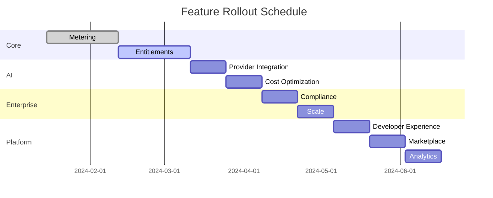

# OpenMonetize Implementation Roadmap

## Overview

This document outlines the phased implementation approach for building OpenMonetize from MVP to production-ready platform. Each phase builds upon the previous, ensuring continuous delivery of value while maintaining architectural integrity.

## Implementation Phases

### Phase 0: Foundation (Weeks 1-2) ✅
**Goal**: Establish development environment and core infrastructure

### Phase 1: MVP - Core Metering (Weeks 3-6)
**Goal**: Basic usage tracking and billing functionality

### Phase 2: Entitlements & Credits (Weeks 7-10)
**Goal**: Real-time access control and credit management

### Phase 3: AI Optimization (Weeks 11-14)
**Goal**: Cost optimization and intelligent routing

### Phase 4: Enterprise Features (Weeks 15-18)
**Goal**: Compliance, white-label, and scale

### Phase 5: Platform Ecosystem (Weeks 19-24)
**Goal**: Marketplace, integrations, and community

## Phase 0: Foundation (Weeks 1-2) ✅

### Infrastructure Setup

```yaml
tasks:
  - name: Development Environment
    items:
      - Setup Git repository
      - Configure CI/CD pipeline
      - Docker development environment
      - Local Kubernetes cluster

  - name: Core Dependencies
    items:
      - PostgreSQL setup
      - Redis cluster
      - Kafka installation
      - ClickHouse configuration

  - name: Monitoring Stack
    items:
      - Prometheus setup
      - Grafana dashboards
      - Jaeger tracing
      - ELK stack
```

### Initial Codebase

```bash
# Repository structure
openmonetize/
├── services/
│   ├── entitlement/    # Rust service
│   ├── metering/       # Go service
│   ├── api-gateway/    # Node.js
│   └── shared/         # Shared libraries
├── infrastructure/
│   ├── terraform/
│   ├── kubernetes/
│   └── docker/
├── sdks/
│   ├── node/
│   ├── python/
│   └── go/
└── docs/
```

## Phase 1: MVP - Core Metering (Weeks 3-6)

### Sprint 1: Event Ingestion (Week 3-4)

**Deliverables:**
- HTTP API for event ingestion
- Kafka event pipeline
- Basic deduplication
- PostgreSQL event storage

```javascript
// Minimal working API
POST /v1/events
{
  "customer_id": "cust_123",
  "event_type": "api_call",
  "value": 1,
  "timestamp": "2024-01-15T10:30:00Z"
}
```

### Sprint 2: Usage Aggregation (Week 5-6)

**Deliverables:**
- Time-window aggregation
- Customer usage queries
- Basic billing calculations
- Simple dashboard

```sql
-- Core aggregation query
SELECT
  customer_id,
  event_type,
  DATE_TRUNC('day', timestamp) as day,
  SUM(value) as total_usage
FROM events
GROUP BY 1, 2, 3;
```

### MVP Success Criteria

- [ ] Can ingest 10K events/second
- [ ] Sub-second aggregation queries
- [ ] 99.9% uptime
- [ ] Basic API documentation
- [ ] First test customer onboarded

## Phase 2: Entitlements & Credits (Weeks 7-10)

### Sprint 3: Entitlement Engine (Week 7-8)

**Core Features:**

```rust
// Rust entitlement service
pub struct EntitlementEngine {
    rules: Vec<EntitlementRule>,
    cache: Cache<String, bool>,
}

impl EntitlementEngine {
    pub fn check(&self, request: CheckRequest) -> CheckResponse {
        // Feature flag checks
        // Usage limit validation
        // Plan-based access control
    }
}
```

**Deliverables:**
- Feature flag system
- Usage limits
- Plan definitions
- Redis caching layer

### Sprint 4: Credit System (Week 9-10)

**Credit Management Features:**

```python
class CreditManager:
    def __init__(self):
        self.pools = {}  # Customer credit pools
        self.burn_rates = {}  # Feature burn rates

    def allocate_credits(self, customer_id, amount):
        """Add credits to customer pool"""

    def consume_credits(self, customer_id, feature, usage):
        """Deduct credits based on burn rate"""

    def get_balance(self, customer_id):
        """Get current credit balance"""
```

**Deliverables:**
- Credit pool management
- Burn table configuration
- Credit transaction ledger
- Balance APIs

## Phase 3: AI Optimization (Weeks 11-14)

### Sprint 5: Provider Integration (Week 11-12)

**Multi-Provider Support:**

```yaml
providers:
  openai:
    models: [gpt-4, gpt-3.5-turbo]
    pricing: tiered
    regions: [us-east, eu-west]

  anthropic:
    models: [claude-3-opus, claude-3-sonnet]
    pricing: per-token
    regions: [global]

  google:
    models: [gemini-1.5-pro]
    pricing: context-aware
    regions: [us, eu, asia]
```

**Deliverables:**
- Provider abstraction layer
- Unified API interface
- Cost tracking per provider
- Fallback mechanisms

### Sprint 6: Cost Optimization (Week 13-14)

**Optimization Features:**

```javascript
class OptimizationEngine {
  async routeRequest(request) {
    const providers = await this.getAvailableProviders();
    const costs = await this.estimateCosts(request, providers);

    // Select optimal provider
    const optimal = this.selectOptimal(costs, {
      strategy: request.optimizationStrategy, // 'cost' | 'latency' | 'quality'
      constraints: request.constraints
    });

    return {
      provider: optimal.provider,
      model: optimal.model,
      estimatedCost: optimal.cost,
      savings: optimal.savings
    };
  }
}
```

**Deliverables:**
- Intelligent routing algorithm
- Cache optimization
- Model recommendation engine
- Cost forecasting

## Phase 4: Enterprise Features (Weeks 15-18)

### Sprint 7: Financial Compliance (Week 15-16)

**Revenue Recognition:**

```sql
-- ASC 606 compliant revenue recognition
CREATE TABLE revenue_recognition (
  id UUID PRIMARY KEY,
  customer_id UUID,
  performance_obligation_id UUID,
  amount DECIMAL(10,2),
  recognized_at TIMESTAMP,
  period_start DATE,
  period_end DATE,
  audit_trail JSONB
);
```

**Deliverables:**
- Revenue recognition engine
- Audit trail system
- Financial reporting APIs
- Compliance dashboards

### Sprint 8: Enterprise Scale (Week 17-18)

**Scaling Features:**

```yaml
enterprise_features:
  multi_tenancy:
    - Isolated databases
    - Custom domains
    - White-label UI

  security:
    - SSO/SAML integration
    - Role-based access
    - Encryption at rest
    - Audit logging

  sla:
    - 99.99% uptime
    - <10ms latency
    - 24/7 support
```

**Deliverables:**
- Multi-tenant architecture
- SSO integration
- Advanced RBAC
- SLA monitoring

## Phase 5: Platform Ecosystem (Weeks 19-24)

### Sprint 9: Developer Experience (Week 19-20)

**SDK Development:**

```typescript
// TypeScript SDK with full type safety
import { OpenMonetize } from '@openmonetize/sdk';

const om = new OpenMonetize<MyEventTypes>({
  apiKey: process.env.OM_API_KEY,
  environment: 'production'
});

// Type-safe event recording
await om.events.record({
  type: 'ai_generation',
  customerId: 'cust_123',
  properties: {
    model: 'gpt-4',
    tokens: 1500
  }
});
```

**Deliverables:**
- SDK for 5+ languages
- Interactive documentation
- Code examples
- Postman collection

### Sprint 10: Marketplace (Week 21-22)

**Extension System:**

```javascript
// Plugin architecture
class PluginSystem {
  register(plugin) {
    this.plugins.set(plugin.name, plugin);
    this.hooks.register(plugin.hooks);
  }

  async execute(hookName, context) {
    const handlers = this.hooks.get(hookName);
    for (const handler of handlers) {
      context = await handler(context);
    }
    return context;
  }
}
```

**Deliverables:**
- Plugin architecture
- Marketplace UI
- Developer portal
- Revenue sharing system

### Sprint 11: Advanced Analytics (Week 23-24)

**ML-Powered Insights:**

```python
class PredictiveAnalytics:
    def __init__(self):
        self.churn_model = ChurnPredictor()
        self.forecast_model = UsageForecaster()
        self.anomaly_detector = AnomalyDetector()

    def analyze_customer(self, customer_id):
        return {
            'churn_risk': self.churn_model.predict(customer_id),
            'usage_forecast': self.forecast_model.predict(customer_id),
            'anomalies': self.anomaly_detector.detect(customer_id)
        }
```

**Deliverables:**
- Predictive analytics
- Anomaly detection
- Custom reporting
- Data export APIs

## Technical Milestones

### Performance Targets

| Milestone | Target | Deadline |
|-----------|--------|----------|
| MVP Launch | 10K events/sec | Week 6 |
| Beta | 100K events/sec | Week 10 |
| GA | 1M events/sec | Week 14 |
| Enterprise | 10M events/sec | Week 18 |

### Feature Rollout



## Go-to-Market Alignment

### Alpha (Week 6-10)
- 10 design partners
- Private Discord channel
- Weekly feedback sessions
- No SLA

### Beta (Week 11-18)
- 100 beta users
- Public documentation
- Community Slack
- 99% uptime SLA

### GA (Week 19+)
- Public launch
- Self-serve onboarding
- 99.9% uptime SLA
- 24/7 support

## Risk Mitigation

### Technical Risks

| Risk | Mitigation |
|------|------------|
| Scaling bottlenecks | Load testing from week 1 |
| Data loss | Multi-region replication |
| Security breach | Security audits every phase |
| Provider outages | Multi-provider redundancy |

### Business Risks

| Risk | Mitigation |
|------|------------|
| Slow adoption | Free tier, migration tools |
| Competition | Fast iteration, unique features |
| Compliance issues | Early legal review |
| Talent shortage | Remote-first hiring |

## Success Metrics

### Technical KPIs

```yaml
week_6:  # MVP
  - Events processed: 1M/day
  - Uptime: 99%
  - Latency p95: <100ms

week_14:  # Beta
  - Events processed: 100M/day
  - Uptime: 99.9%
  - Latency p95: <50ms

week_24:  # GA
  - Events processed: 1B/day
  - Uptime: 99.99%
  - Latency p95: <20ms
```

### Business KPIs

```yaml
week_6:  # MVP
  - Design partners: 10
  - Weekly active: 10

week_14:  # Beta
  - Total users: 100
  - Weekly active: 50
  - MRR: $10K

week_24:  # GA
  - Total users: 1000
  - Weekly active: 500
  - MRR: $100K
```

## Resource Requirements

### Team Composition

| Role | Phase 1 | Phase 2 | Phase 3 | Phase 4 | Phase 5 |
|------|---------|---------|---------|---------|---------|
| Backend Engineers | 2 | 3 | 4 | 5 | 5 |
| Frontend Engineers | 1 | 1 | 2 | 2 | 3 |
| DevOps | 1 | 1 | 2 | 2 | 2 |
| Product Manager | 1 | 1 | 1 | 2 | 2 |
| Designer | 0 | 1 | 1 | 1 | 2 |
| QA | 0 | 1 | 1 | 2 | 2 |

### Infrastructure Costs

```yaml
phase_1:  # MVP
  monthly_cost: $2,000
  components:
    - Kubernetes cluster (small)
    - PostgreSQL (single)
    - Redis (small)

phase_3:  # Beta
  monthly_cost: $10,000
  components:
    - Kubernetes cluster (medium)
    - PostgreSQL (multi-region)
    - Redis cluster
    - CDN

phase_5:  # Production
  monthly_cost: $50,000
  components:
    - Multi-region Kubernetes
    - Database clusters
    - Global CDN
    - Monitoring stack
```

## Next Steps

### Immediate Actions (Week 1)

1. **Setup Development Environment**
   ```bash
   git clone https://github.com/openmonetize/openmonetize
   ./scripts/setup-dev.sh
   docker-compose up
   ```

2. **Initialize Core Services**
   ```bash
   cd services/metering
   go mod init
   make test
   ```

3. **Deploy Local Stack**
   ```bash
   kubectl apply -f infrastructure/kubernetes/dev/
   ```

### Week 1 Deliverables

- [ ] Git repository created
- [ ] CI/CD pipeline configured
- [ ] Development environment ready
- [ ] Initial API design documented
- [ ] Database schema designed
- [ ] First unit tests written

## Conclusion

This roadmap provides a clear path from concept to production-ready platform. By following this phased approach, we can:

1. **Deliver value quickly** with an MVP in 6 weeks
2. **Validate assumptions** with real customers early
3. **Scale gradually** based on actual demand
4. **Maintain quality** through continuous testing
5. **Build community** alongside the product

The modular architecture ensures we can adapt the roadmap based on customer feedback and market conditions while maintaining our core vision of becoming the open-source standard for AI monetization.